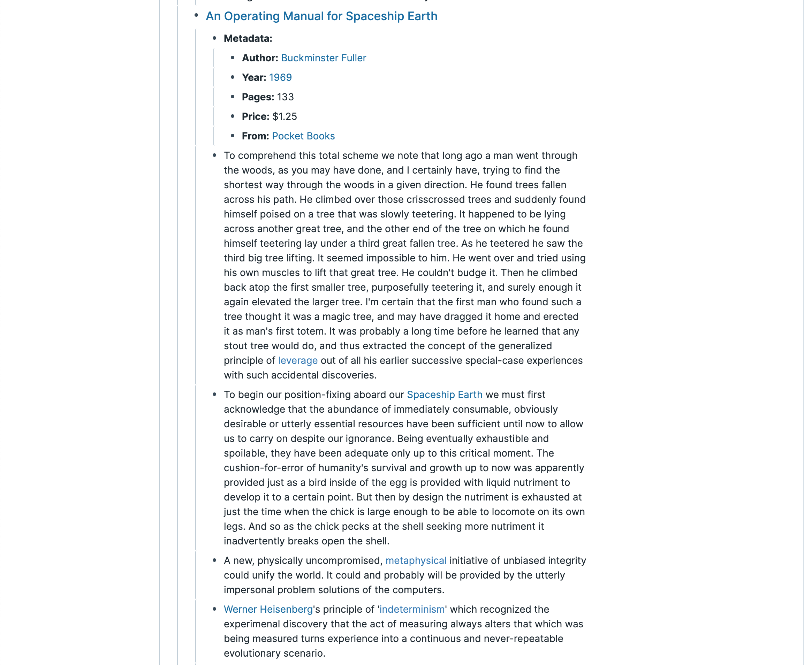
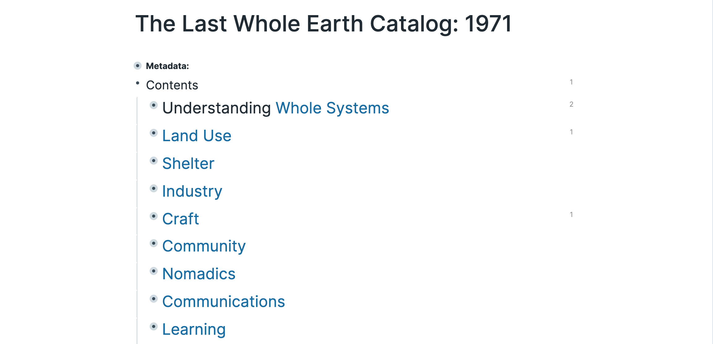
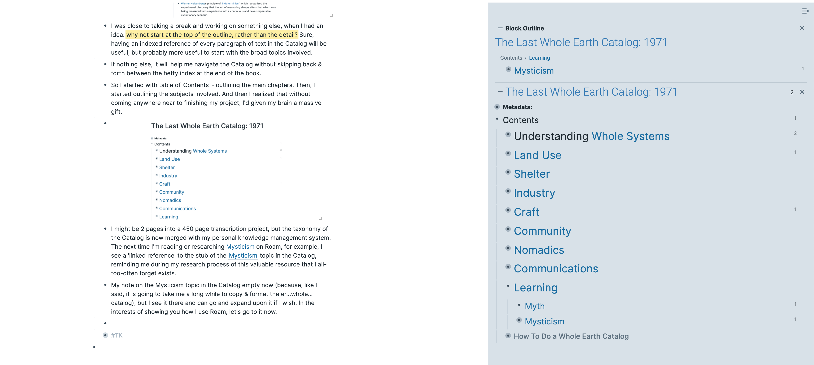
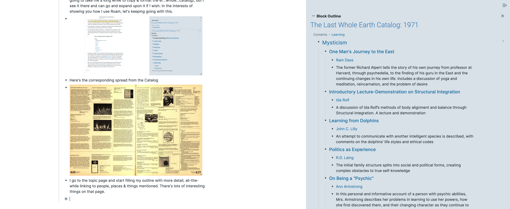
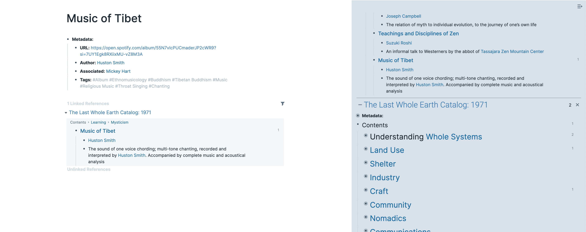
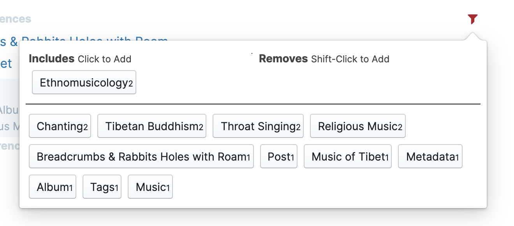

[Roam](https://roamresearch.com/) is a potent example of technology for _Augmenting Human Intelligence_. Similar-but-different to _Artificial Intelligence_, _AHI_ tools focus on turbocharging your brain, rather than replacing it with some fancy algorithm. Oft-mentioned, but the power in Roam is how it enables you to make connections between topics as you read, research, think & write, and develop notes into real creative output.

As someone who both struggles-with and prospers-from _ADHD_, Roam is the only tool I've found that fits my brain like a glove: enabling me to capture as fast as I can think, and to leave breadcrumbs for myself on the research rabbit holes I go down.

**I haven't gotten around to implement full Roam-style links in this blog yet. Anything in _italics_ in this post is something that was a link in Roam - I left them in so you can see the types of concepts I like to map.**

I haven't written anything longer than an Instagram caption in 2 years, but here are 200 words I accidentally wrote _Stream of Consciousness_ explaining some of the magic I found during an 8 hour Roam session today. It just kinda happened.

> “I only went out for a walk and finally concluded to stay out till sundown, for going out, I found, was really going in.” — John Muir

The _Whole Earth Catalog_ is a seminal publication from the _1960s_ _Counterculture_ era; a huge collection of resources for those interested in everything from the _Ecology_ and _Organic Gardening_ to _Psychology_ and _Psychedelics_. It's a rich resource, but exists on paper and huge PDF scans. 1960s counterculture also produced _Personal Computers_ and there's rich adjacency between _Augmenting Human Intelligence_ & the very notion of the Catalog. Roam is today's spiritual successor to _Ted Nelson_'s _Project Xanadu_ with its notions of _Bidirectional Linking_.

Today I had the idea to start transcribing _The Last Whole Earth Catalog: 1971_ into _Roam_ to explore using _Bidirectional Linking_ to browse its contents and inform my research in every area of interest I have.

If you haven't read the Whole Earth Catalog before, it might be helpful to understand a little about how it's structured.

- There are 9-ish top-level chapters - "Understanding _Whole
  Systems_", "_Land Use_", "_Craft_" and such.

- Each chapter contains ~30-70 pages, each with resources for a discrete topic: "_Universe_", "_Ecology_", "_Biodynamic Gardening_" etc.

- Finally, each topic contains several titles: either listings of physical products (mostly books or tools etc) to buy, or letters from readers, comments, poems etc.

I started diligently at the beginning of Chapter 1 ("Understanding _Whole Systems_"), Subject 1 ("_Buckminster Fuller_"), Topic 1 ("_Utopia or Oblivion_"). Typing out every paragraph by hand—my OCR wasn't working well—and then going back and linking up topics. The Catalog is some 450 pages long; after 2 hours I had had a great time reading every word I'd typed about Fuller, but I realized it would take me an extremely long time to finish the project.

I was close to taking a break and working on something else, when I had an idea: ^^why not start at the top of the outline, rather than the detail?^^ Sure, having an indexed reference of every paragraph of text in the Catalog will be useful, but probably more useful to start with the broad topics involved.

If nothing else, it will help me navigate the Catalog without skipping back & forth between the hefty index at the end of the book.

So I started with table of "Contents" - outlining the main chapters. Then, I started outlining the subjects involved. And then I realized that without coming anywhere near to finishing my project, I'd given my brain a massive gift.

I might be 2 pages into a 450 page transcription project, but the taxonomy of the Catalog is now merged with my personal knowledge management system. The next time I'm reading or researching _Mysticism_ on Roam, for example, I see a 'linked reference' to the stub of the "_Mysticism_" topic in the Catalog, reminding me during my research process of this valuable resource that I all-too-often forget exists.

My note on the Mysticism topic in the Catalog empty (because, like I said, it is going to take me a long while to copy & format the er…whole…catalog), but I see it there and can go and expand upon it if I wish. In the interests of showing you how I use Roam, let's keeping going with this.

Here's the corresponding spread from the Catalog

I go to the topic page and start filling my outline with more detail, all-the-while linking to people, places & things mentioned. There's lots of interesting things on that page.

An album callled _Music of Tibet_ by monks at the _Gyuto Monastery_ catches my eye. It was recorded by _Huston Smith_. I quickly copy over some notes from the Catalog to Roam, then go down an internet rabbit hole searching for information about it. To start with, Smith seems like an interesting character who should be on my radar. I'm sure I'll be reading more about him in the coming weeks & months.

I see the production was assisted by _Mickey Hart_: a _percussionist_, the drummer from the _Grateful Dead_, and an _ethnomusicologist_. I don't make bidirectional links for everyone on the album credits list (for one thing, I've been writing this article for hours and I want to go outside before it gets dark…), but Hart seems to crop up over & over again in my research and noting down his involvement seems like it will be useful in the future.

At this point, I add some tags to note in Roam - this will be useful when researching _Buddhism_ in general, _Tibetan Buddhism_ more specifically, _Chanting_, _Throat Singing_, _Religious Music_, _Ethnomusicology_…

My tags are relatively general - preferring _Buddhism_ and _Music_ to _Buddhist Music_ for example: I can query for BOTH of them together later. Or _Tibetan Buddhism_ and _Music_. or _Throat Singing_ and _Ethnomusicology_, or _Ethnomusicology_ and _Album_…you get the idea.

I eventually find the recording on Spotify, add the URL to my notes in Roam (more useful than a defunct PO Box, surely?) and start listening to it. It's fascinating, with each monk's voice producing multiple _overtones_. Like they're singing chords. Wow.

Meanwhile, whilst I was researching the album on YouTube I found a bunch of interesting YouTube interviews with Smith. I want to watch all of them, right now, but I'm trying to stay on track writing this article. They can wait. My usual options are:

- Drop everything I'm doing to chase after every idea I have like my cat chasing a fly around the house. My _ADHD_ brain. It's fun, but exhausting, and I really am trying to stay on track with my projects this year.

- Leave the tabs open for later. This is how I end up with 20 Chrome windows open with 50 tabs in each. I'm trying to cut down on that, too

- Use a bookmarking service. They've never worked for me, though - I never find things again.

Instead, in Roam, I drop interesting snippets in the right place, confident that bidirectional linking will help me find my notes and _my notes find me_. So I store an interesting interview with Smith from the later years of his life in _The Spirit Molecule_ - it will pop up when I'm researching _Psychedelics_ in the future. I also store an interview with him and _Bill Moyers_ about _Hinduism_. Onwards!

Back in the Catalog there's a series of recordings from _Esalen_ that I hadn't heard of before, including lectures by _Ram Dass_, _John C. Lilly_, _Stanislav Grof_, _Suzuki Roshi_ and _Joseph Campbell_. If this was 1971 I could have just sent a check to the address listed in the Catalog, but alas I presume any of the publishers mentioned who still _exist_ 50 years later have long since changed locations. Still, now we have search engines, and the _Internet Archive_, and the revolving crew of interesting intergenerational techno-hippies who prop up the bar at _The Interval_ in San Francisco and all seem to have sprawling personal libraries in the _Santa Cruz_ Mountains. I'm sure any resource I might need is findable - chatting to old hippies about the _Counterculture_ of the _1960s_ is my favorite thing.

Mostly, I need to capture this information so I know where to find it later. I'm reminded of the concept in _Getting Things Done_ whereby we use our brain to have creative ideas, not to _remember_ todos & trivia. This seems conceptually similar to _Building a Second Brain_, and now, right here as I type this outline, I've linked together _GTD_, _BASB_, and _Bidirectional Linking_ & _Notetaking_. Cool, Roam. Cool.

I make a note of the recordings and pop over to my _Joseph Campbell_ page. I'm a sucker for _anything_ related to him, so even at this early stage of using Roam his page is starting to accrue quotes, notes & reflections about him from all of the information I process. For one thing, I see my notes from _The Power of Myth_ that he recording with _Bill Moyers_. Wait a second, _Bill Moyers_! We just mentioned him in relation to _Huston Smith_. I see another link in my knowledge.

And then, the _linked references_ section of that page in Roam, I see a mention to a totally different section of Roam: "_Myth_". Down another rabbit hole I go, all the while confident that my wild, weird & creative ADHD brain is working in perfect harmony with my technology instead of fighting it or being destructively enabled by it.

Where once my days-long internet rabbit holes felt like distraction (at best) or self-sabotage (at worst), using Roam gives me confidence that I'm spending my time wisely and capturing knowledge in a way that helps me make links between disparate topics. This, more than any particular discipline of creativity, is my favorite thing: _Creativity_ itself, rather than _Art_ or _Music_ or _Design_ or _Creative Technology_. I am a humble student of _Serendipity_ and _Synchronicity_, and the magic of connecting ideas in new ways.

With Roam I have a tool that lets me progressively expand my notes from keywords and stubs to paragraphs to reflections. Those reflections drive thoughts that transfigure into braindumps into structured outlines to a full essay.
This doesn't even touch on 3 of my other favorite uses for Roam:

- a (friend) CRM, helping me keep track of context, shared knowledge & commitments with the people I care about

- a supercharged task management system, ultra-flexible based around _GTD_ with integration into my _Knowledge Management_ system

- an extremely convenient Daily Logbook, with seamless referencing of notes & tasks.

More on those soon I guess. I didn't intend to write this article - I was honestly just trying to spend my afternoon adding some links to my notes about _Buckminster Fuller_, but 2000 words later, here we are. This is the most I've written in a single session in as long as I can remember: definitely several years.

Roam is a tool that turns my brain into a supercomputer.
